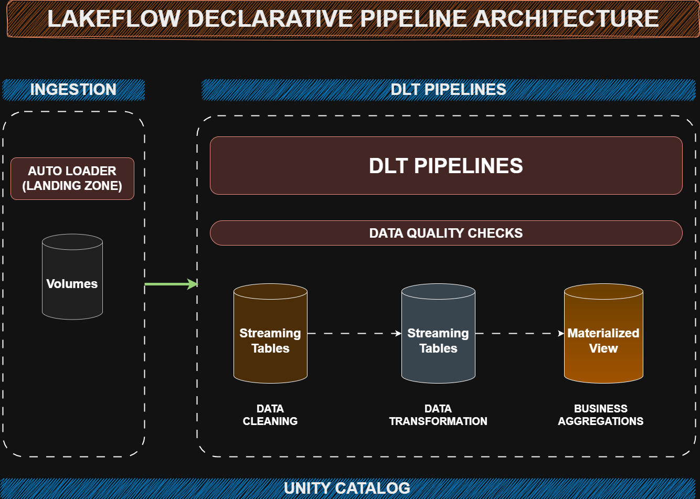
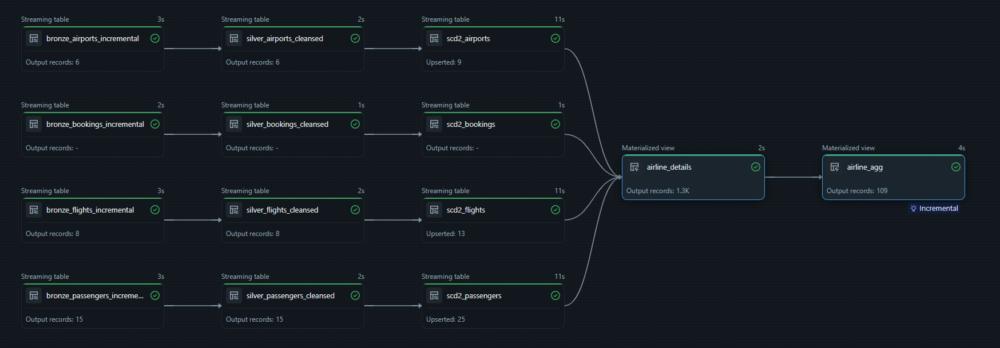

# ✈️ Databricks LakeFlow Declarative Pipelines — Aviation Analytics Project

This repository showcases a complete **end-to-end Aviation Analytics pipeline** built using **Databricks LakeFlow Declarative Pipelines (DLT)** and **Workflows**, following the modern **Lakehouse Medallion Architecture**.

The project demonstrates how to design a **reliable, declarative, and production-ready ETL pipeline** that ingests aviation datasets (Bookings, Flights, Passengers, Airports), processes them using DLT, applies **SCD Type-2 CDC**, and powers BI dashboards through **Gold-layer business aggregates**.

---

## 🏗️ LakeFlow Architecture



This architecture outlines the full lifecycle:

- **Auto Loader ingestion** from `/datasets/source_data/`
- **DLT pipeline** handling Bronze → Silver → Silver SCD2 → Gold transformations
- **Data quality enforcement** through expectations
- **Business aggregations** for aviation analytics
- **Dashboard-ready outputs**
- **Workflow-based orchestration**
- **Unified governance with Unity Catalog**

---

## 🔄 LakeFlow Declarative Architecture (Streaming + SCD2 + Business Models)

This pipeline combines **continuous streaming ingestion**, **schema evolution**, **SCD Type-2 historical tracking**, and **incremental Gold-layer aggregations**:

- **Streaming Tables (Bronze → Silver):**  
  All ingestion and cleansing steps rely on DLT streaming tables using `spark.readStream`.

- **SCD Type-2 Dimensions (Silver SCD2):**  
  Powered by `dlt.create_auto_cdc_flow()` to automatically maintain history.

- **Gold Layer Business Models:**  
  Aggregated analytics-ready datasets that refresh efficiently as upstream tables change.

This design ensures **high freshness**, **low latency**, and **reliable historical tracking** from raw files → business insights.

---

## 🚀 Project Overview

This project simulates an aviation data engineering workflow using:

- **Streaming ingestion** of flight, passenger, booking, and airport datasets  
- **Cleansing & validation** using DLT expectations  
- **Transformations & enrichment** (date processing, type casting, standardization)  
- **SCD Type-2 processing** with automatic CDC  
- **Business reporting layer** via Gold aggregated tables  
- **Automated orchestration** through Workflows  
- **Ready-to-consume datasets** for Databricks AI/BI or Power BI dashboards

This project uses a fully streaming Lakehouse pipeline where:

- **Bronze Layer → Streaming Tables (Auto Loader)**
- **Silver Layer → Streaming Tables**
- **Silver SCD2 Layer → Auto-CDC Versioned Tables**
- **Gold Layer → Aggregated Business Models**

All transformations up to Gold run incrementally using **DLT Streaming Tables**, ensuring the pipeline remains **live, scalable, and production-ready**.

---

## 🧰 Tech Stack

| Layer | Technology |
|-------|------------|
| Ingestion | Databricks Auto Loader (`cloudFiles`) |
| Processing | LakeFlow — Delta Live Tables (DLT) |
| CDC / History Tracking | DLT Auto-CDC (SCD Type-2) |
| Storage | Databricks Volumes (Delta Lake) |
| Governance | Unity Catalog |
| Orchestration | LakeFlow Workflows |
| BI Reporting | Databricks AI/BI Dashboard / Power BI / Tableau |

---

## 🗂️ Dataset Description

The project uses four aviation datasets stored under `datasets/source_data/`:

- **airports.csv** — airport name, city, country, region  
- **flights.csv** — airline, origin, destination, flight date  
- **passengers.csv** — name, gender, nationality  
- **bookings.csv** — booking id, passenger id, flight id, airport id, amount, booking date  

These datasets are incrementally ingested via **Auto Loader**.

---

## 🪜 Lakehouse Medallion Architecture (Streaming + SCD2)

### 🥉 Bronze — *Streaming Tables (Auto Loader)*

**Notebook:** `00_bronze_layer.py`  
Creates four streaming ingestion tables:

- `bronze_bookings_incremental`  
- `bronze_airports_incremental`  
- `bronze_flights_incremental`  
- `bronze_passengers_incremental`  

**Source paths:**

- `/Volumes/aviation/airline_data/source_data/bookings/`
- `/Volumes/aviation/airline_data/source_data/airports/`
- `/Volumes/aviation/airline_data/source_data/flights/`
- `/Volumes/aviation/airline_data/source_data/passengers/`

---

### 🥈 Silver — *Cleansed Streaming Tables*

**Notebook:** `01_silver_layer.py`  

Includes:

- Type casting  
- Date conversions  
- Data quality validations  
- `modified_date` column for SCD2 sequencing  

Creates:

- `silver_bookings_cleansed`  
- `silver_airports_cleansed`  
- `silver_flights_cleansed`  
- `silver_passengers_cleansed`  

---

### 🥈 Silver — *SCD Type-2 Auto-CDC Tables*

**Notebook:** `01_silver_scd_layer.py`  

Built using:

- `dlt.create_streaming_table()`
- `dlt.create_auto_cdc_flow()`

Creates versioned SCD2 tables:

- `scd2_bookings`  
- `scd2_airports`  
- `scd2_flights`  
- `scd2_passengers`  

Features:

- Automatic SCD2 record creation  
- Maintains `__START_AT` and `__END_AT`  
- Tracks full historical changes  

---

### 🥇 Gold — *Aggregated Business Models*

**Notebook:** `02_gold_layer.py`

#### **1. airline_details**  
Joined table combining active:

- Bookings  
- Airports  
- Flights  
- Passengers  

**Filter applied:** 

- `__END_AT IS NULL`

#### **2. airline_agg**  
Aggregated by:

- airline  
- origin  
- destination  

KPIs include:

- Total bookings  
- Total passengers  
- Total flights  
- Total revenue  
- Average ticket amount  

---

## 🔄 DLT Pipeline Lineage



---

## 📁 Repository Structure

```text
aviation-databricks-declarative-pipeline-project/
│
├── assets/
│   ├── aviation_dlt_architecture.png
│   └── aviation_dlt_pipeline.png
│
├── datasets/
│   ├── source_data/
│   │   ├── airports.csv
│   │   ├── flights.csv
│   │   ├── passengers.csv
│   │   └── bookings.csv
│   │
│   ├── incremental_data/
│   └── scd_data/
│
├── notebooks/
│   ├── 00_bronze_layer.py
│   ├── 01_silver_layer.py
│   ├── 01_silver_scd_layer.py
│   └── 02_gold_layer.py
│
└── README.md
